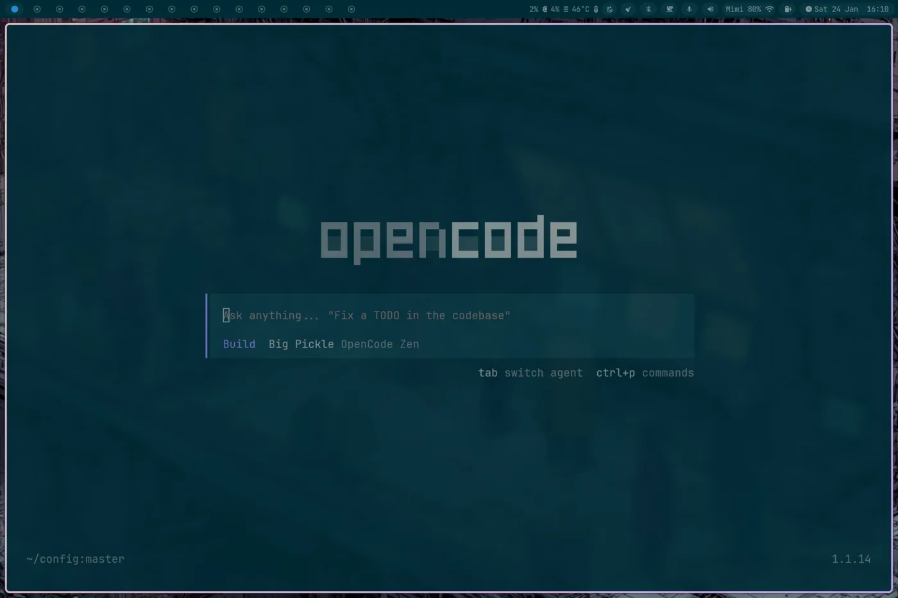

# NixOS Configuration

A complete NixOS setup with Hyprland window manager, configured to be an easy switch from a macOS setup.

## Overview

This configuration includes:
- **NixOS 25.11** with latest kernel
- **Hyprland** Wayland compositor with custom keybindings
- **ReGreet** login manager with Cage and custom styling
- **Waybar** status bar with custom modules and theme switching
- **Kitty** terminal with Solarized Dark theme
- **Starship** prompt with Solarized palette
- Development tools and utilities




## System Configuration

### Core Features
- Latest Linux kernel
- NetworkManager for networking (WiFi power saving disabled)
- PipeWire for audio with WirePlumber session management
- 1Password integration with fingerprint authentication support
- Touchpad support with natural scrolling
- US keyboard layout with Alt/Win swap
- ReGreet login manager with Cage and custom theming
- Power profiles daemon for performance management
- Fingerprint authentication support
- Thunderbolt support
- BIOS/firmware updates via fwupd
- Docker containerization support

### Installed Packages
- **Development**: git, curl, vim, wget, nodejs_22, pnpm, opencode, docker, docker-compose, postgresql, gcc, clang, cmake, ninja, go, gopls, delve, python3, yarn, lazygit, gitui, gh, mkcert, nssTools
- **Terminal**: kitty, starship, bash-completion, fzf, ripgrep, bat, eza, fd, zoxide, jq, jless, yazi
- **Desktop**: waybar, dunst, wl-clipboard, grim, slurp, rofi, wofi, wlogout, brightnessctl, wob, polkit_gnome
- **System**: pavucontrol, pulseaudio, networkmanagerapplet, wireplumber, blueman, fwupd, bolt, fprintd, power-profiles-daemon
- **Browser**: Brave
- **Security**: hyprlock, hypridle
- **Media**: mpv, ffmpeg-full, celluloid, gthumb, imagemagick
- **Screen Recording**: grim, slurp, swappy, satty, wf-recorder
- **Image Tools**: imagemagick, oxipng, pngquant, libwebp
- **Applications**: slack, obsidian, code-cursor, brave
- **Authentication**: 1Password CLI + GUI with fingerprint support

### Fonts
- Inter (UI font)
- JetBrains Mono Nerd Font (terminal)

## Directory Structure

```
config/
├── nixos/
│   ├── configuration.nix          # Main system configuration
│   ├── hardware-configuration.nix # Hardware-specific settings
│   └── greetd/                    # ReGreet login manager configs
│       ├── regreet.toml           # Login manager settings
│       ├── regreet.css            # Custom styling
│       └── background.png         # Login background
├── hypr/
│   ├── hyprland.conf              # Hyprland window manager config
│   ├── hypridle.conf              # Idle management
│   └── mocha.conf                 # Catppuccin Mocha color scheme
├── waybar/
│   ├── config                     # Waybar configuration
│   ├── style.css                  # Waybar styling
│   ├── style-light.css            # Light theme variant
│   ├── style-dark.css             # Dark theme variant
│   └── scripts/                   # Custom scripts (volume, mic, calendar, bluetooth, brightness, theme)
├── kitty/
│   └── kitty.conf                 # Terminal emulator config
├── starship/
│   └── starship.toml              # Shell prompt configuration
├── rofi/
│   ├── config.rasi                # Rofi theming
│   └── themes/                    # Custom themes
├── wofi/
│   └── style.css                  # Wofi styling
├── wlogout/
│   └── layout                     # Logout screen layout
├── wob/
│   └── wob.ini                    # On-screen display configuration
├── mpv/
│   └── mpv.conf                   # Media player config
├── scripts/
│   ├── display-hotplug.sh         # Multi-monitor setup
│   ├── record-screen.sh           # Screen recording
│   ├── set-random-wallpaper.sh    # Wallpaper management
│   ├── switch-waybar-config.sh    # Waybar config switching
│   ├── toggle-terminal.sh         # Terminal toggle script
│   ├── osd-brightness.sh          # Brightness OSD
│   ├── osd-volume.sh              # Volume OSD
│   └── convert-webp.sh            # WebP conversion utility
├── systemd/
│   └── user/                      # User services
│       ├── waybar.service         # Waybar systemd service
│       └── polkit-gnome-agent.service  # Authentication agent
├── bashrc                         # Shell configuration
└── inputrc                        # Input configuration
```

## Installation

### Prerequisites
- NixOS installation media
- Target system with UEFI boot support

### Setup Steps

1. **Clone this repository:**
   ```bash
   git clone <repository-url> /mnt/etc/nixos/config
   ```

2. **Generate hardware configuration:**
   ```bash
   nixos-generate-config --root /mnt
   ```

3. **Copy configuration:**
   ```bash
   cp /mnt/etc/nixos/config/nixos/configuration.nix /mnt/etc/nixos/
   cp /mnt/etc/nixos/config/nixos/hardware-configuration.nix /mnt/etc/nixos/
   ```

4. **Install NixOS:**
   ```bash
   nixos-install
   ```

5. **Reboot and setup user configs:**
   ```bash
   # After reboot, create symlinks to dotfiles in home directory
   ln -s /etc/nixos/config/hypr ~/.config/hypr
   ln -s /etc/nixos/config/waybar ~/.config/waybar
   ln -s /etc/nixos/config/kitty ~/.config/kitty
   ln -s /etc/nixos/config/starship ~/.config/starship
   ln -s /etc/nixos/config/rofi ~/.config/rofi
   ln -s /etc/nixos/config/wofi ~/.config/wofi
   ln -s /etc/nixos/config/wlogout ~/.config/wlogout
   ln -s /etc/nixos/config/mpv ~/.config/mpv
   ln -s /etc/nixos/config/scripts ~/scripts
   ln -s /etc/nixos/config/bashrc ~/.bashrc
   ln -s /etc/nixos/config/inputrc ~/.inputrc
   ```

## Configuration Details

### Hyprland
- **Mod key**: SUPER (Windows key)
- **Keybindings**:
  - `SUPER + ENTER`: Launch Kitty
  - `SUPER + W`: Close window
  - `SUPER + F`: Fullscreen
  - `SUPER + L`: Lock screen
  - `SUPER + SHIFT + L`: Suspend
  - `SUPER + H/J/K/L`: Navigate windows
  - `SUPER + SHIFT + H/J/K/L`: Move windows
  - `SUPER + 1-9`: Switch workspaces
  - `SUPER + SHIFT + 1-9`: Move to workspace
  - `SUPER + SPACE`: Application launcher (Rofi)
  - `SUPER + TAB`: Window switcher
  - `SUPER + S`: Screenshot (area selection)
  - `SUPER + SHIFT + S`: Screen recording
  - `SUPER + ALT + S`: Screenshot annotation (Satty)
- **Multi-monitor**: Auto workspace switching with display-hotplug script

### Waybar Modules
- **Workspaces**: Hyprland workspace indicators with auto-switching
- **Clock**: Date/time with calendar popup
- **Volume**: Audio control with scroll adjustment and OSD (wob)
- **Microphone**: Mic toggle
- **Network**: WiFi/Ethernet status
- **Bluetooth**: Device connection management
- **Brightness**: Display brightness control with OSD (wob)
- **Battery**: Power status and remaining time
- **Tray**: System tray icons
- **Theme Switcher**: Toggle between light/dark themes

### Terminal (Kitty)
- **Font**: JetBrains Mono Nerd Font (13pt)
- **Theme**: Solarized Dark
- **Features**: Ligatures enabled, custom padding

### Shell (Bash + Starship)
- **Enhancements**: zoxide for smart navigation, fzf for fuzzy search, yazi file manager
- **Aliases**: `ls` uses eza with git info, `dv` for development directory
- **History**: Large history with deduplication
- **Prompt**: Starship with Solarized Dark palette
- **Development**: Docker, Go, Python, Node.js tooling pre-configured
- **Git**: lazygit (TUI), gitui (TUI), GitHub CLI (gh)
- **Code Quality**: golangci-lint, delve debugger, comprehensive tooling

## Customization

### Adding Packages
Edit `nixos/configuration.nix` and add packages to the `environment.systemPackages` list:

```nix
environment.systemPackages = with pkgs; [
  # existing packages...
  new-package
];
```

### Modifying Hyprland
Edit `hypr/hyprland.conf` for keybindings, layouts, and rules.

### Theming
- **Colors**: Edit `hypr/mocha.conf` for Catppuccin colors
- **Waybar**: Modify `waybar/style.css` for bar styling, use `scripts/switch-waybar-config.sh` to switch themes
- **Rofi**: Update `rofi/themes/solarized-dark.rasi`
- **Wallpapers**: Use `scripts/set-random-wallpaper.sh` for random wallpaper selection

## Maintenance

### Update System
```bash
sudo nixos-rebuild switch
```

### Clean Old Generations
```bash
sudo nix-collect-garbage -d
```

### Search Packages
```bash
nix search <package-name>
```

## Primary Features

### Media & Image Processing
- **ImageMagick**: Comprehensive image manipulation toolkit
- **OxiPNG**: Advanced PNG optimization
- **pngquant**: PNG color quantization and compression
- **libwebp**: WebP image format support
- **FFmpeg**: Complete multimedia processing suite

### Applications
- **Slack**: Workspace management (locked to workspace 3)
- **Obsidian**: Note-taking and knowledge management
- **Cursor**: AI-powered code editor
- **Brave**: Privacy-focused web browser
- **gThumb**: Image viewer and editor
- **MPV**: Hardware-accelerated video playback with Celluloid frontend
- **Yazi**: Terminal file manager with image preview support

### Screen Recording & Annotation
- **wf-recorder**: Screen recording with audio
- **Satty**: Screenshot annotation tool
- **Swappy**: Image editing for screenshots
- **OSD Support**: wob for volume/brightness visual feedback

### Security & Authentication
- **1Password**: CLI and GUI integration with biometric unlock
- **Fingerprint Authentication**: fprintd for sudo and polkit authentication
- **Polkit Agent**: GNOME polkit agent for GUI authorization dialogs
- **Secure Boot**: UEFI boot with systemd-boot

### System Enhancements
- **Multi-monitor support**: Auto workspace switching with display hotplug detection
- **Login Manager**: ReGreet with custom theming and background
- **BIOS updates**: fwupd integration for system firmware
- **Docker**: Container support with docker-compose, lazydocker TUI
- **PostgreSQL**: Database server for development
- **Bluetooth**: Full device management with Blueman
- **wlogout**: Modern logout/power menu
- **Fingerprint Auth**: fprintd integration for sudo/polkit authentication
- **Power Management**: power-profiles-daemon for performance scaling

### Scripts
- **display-hotplug.sh**: Multi-monitor workspace management
- **record-screen.sh**: Screen recording with audio
- **set-random-wallpaper.sh**: Wallpaper rotation
- **switch-waybar-config.sh**: Theme switching
- **toggle-terminal.sh**: Terminal visibility toggle
- **osd-brightness.sh**: Brightness on-screen display
- **osd-volume.sh**: Volume on-screen display
- **convert-webp.sh**: WebP image conversion utility

## License

This configuration is provided as-is. Feel free to adapt it to your needs.
